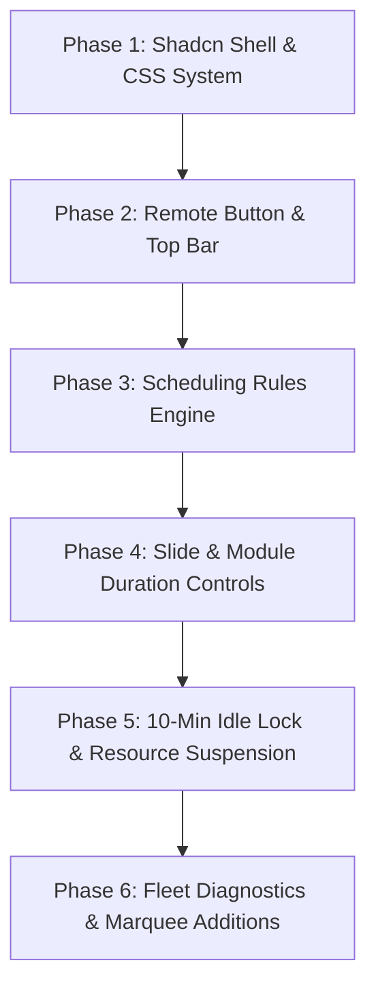

# `masteradmin.html` Shadcn/UI Redesign & Modernization Plan

> **Target:** Modernization of the `_ct-MATRIX` Master Admin Dashboard (`masteradmin.html`)  
> **Architecture:** Shadcn/UI Design System Tokens, Modular Component Architecture, Resource Optimization  
> **Status:** Proposal & Technical Specification (`upgrade-maybe.md`)

---

## 1. Executive Summary & Core Objectives

```
+----------------------------------------------------------------------------------------------------+
|                                    MASTER ADMIN REDESIGN GOALS                                     |
+----------------------------------------------------------------------------------------------------+
| 1. Shadcn/UI Dark Theme     -> Zinc/Slate dark aesthetic, clean borders, crisp typography, radix-feel|
| 2. Prominent Top Remote     -> Header-level action with QR modal and direct remote.html launcher   |
| 3. Hard Schedule Engine     -> Explicit badge & rule system: Hard Scheduled vs Rotation vs Preempt   |
| 4. Granular Duration Engine -> Sliders & overrides for individual slides, modules & whole loop      |
| 5. 10-Minute Resource Lock  -> Unloads heavy iframes/renders upon idle timeout to preserve GPU/RAM |
| 6. Extended Signage Ops     -> Fleet heartbeat, emergency marquee, sheet validator, night standby |
+----------------------------------------------------------------------------------------------------+
```

---

## 2. Shadcn/UI Design System Tokens

### 2.1 CSS Custom Property System (Slate/Zinc Dark Palette)

```css
:root {
  --background: 222.2 84% 4.9%;        /* #020817 - Deepest background */
  --foreground: 210 40% 98%;          /* #f8fafc - Primary text */
  --card: 222.2 84% 6.5%;             /* #030c1d - Card container */
  --card-foreground: 210 40% 98%;
  --popover: 222.2 84% 6.5%;
  --popover-foreground: 210 40% 98%;
  --primary: 43 96% 56%;              /* #f59e0b / #d4af37 Gold Accent */
  --primary-foreground: 26 83% 14%;
  --secondary: 217.2 32.6% 12%;       /* #131d2e - Secondary containers */
  --secondary-foreground: 210 40% 98%;
  --muted: 217.2 32.6% 17.5%;         /* #1e293b - Muted backgrounds */
  --muted-foreground: 215 20.2% 65.1%;/* #94a3b8 - Dim text */
  --accent: 217.2 32.6% 17.5%;
  --accent-foreground: 210 40% 98%;
  --destructive: 0 62.8% 30.6%;       /* #7f1d1d - Danger / Exit */
  --destructive-foreground: 210 40% 98%;
  --border: 217.2 32.6% 17.5%;        /* #1e293b - Subtle container borders */
  --input: 217.2 32.6% 17.5%;
  --ring: 43 96% 56%;                 /* Focus rings */
  --radius: 0.625rem;                 /* 10px rounded corners */
  --font-sans: 'Inter', -apple-system, sans-serif;
  --font-mono: 'JetBrains Mono', monospace;
}
```

### 2.2 Component Standards

*   **Card (`.shadcn-card`):** `border border-border bg-card text-card-foreground rounded-xl shadow-lg p-4`
*   **Button (`.shadcn-btn`):** `inline-flex items-center justify-center rounded-md text-sm font-semibold transition-all h-9 px-4 py-2`
*   **Badge (`.shadcn-badge`):** `inline-flex items-center rounded-full border px-2.5 py-0.5 text-xs font-bold uppercase`
*   **Switch (`.shadcn-switch`):** `peer inline-flex h-5 w-9 shrink-0 cursor-pointer items-center rounded-full border-2 border-transparent transition-colors`
*   **Tabs (`.shadcn-tabs`):** `inline-flex h-9 items-center justify-center rounded-lg bg-muted p-1 text-muted-foreground`

---

## 3. UI Layout & Component Wireframe

```
+------------------------------------------------------------------------------------------------------------------------------------+
| [MATRIX COMMAND] | Telemetry: 14 Slides | [LIVE] • Sync Online | 12:45:00 NZDT | [📱 REMOTE CONTROL] [👁 PREVIEW] [🔄 SYNC] [🔒 LOCK] |
+------------------------+---------------------------------------------------------------+-------------------------------------------+
| SIDEBAR NAVIGATION     | OPERATOR WORKSPACE (C-Frame)                                  | LIVE MONITORS (A & B Frames)              |
| - 📊 Dashboard Overview| [ Tabs: Schedule Manager | Duration Engine | Live Playlist ]  | +---------------------------------------+ |
| - 📅 Schedules & Rules | +-----------------------------------------------------------+ | | A-FRAME: Live 1080p Engine View       | |
| - ⏱ Duration Config   | | Module Schedule Configuration                             | | | (16:9 Scaled Preview of index.html) | |
| - 📋 Playlist Manager  | | [ ct-ace2 ]  [🔒 Hard Scheduled: Tue/Sat 16:00-19:00]      | | +---------------------------------------+ |
| - 🖨 Poster Maker     | | [ ct-mmr  ]  [🔒 Hard Scheduled: Fri 16:00-19:00]          | | [⏮ PREV]  [⏯ PLAY/PAUSE]  [⏭ NEXT]    | |
| - 📁 File Browser      | | [ ct-quiz ]  [🔒 Hard Scheduled: Wed 18:00-19:15]          | | +---------------------------------------+ |
| - 📱 Live Commander    | | [ ct-wea1 ]  [🔄 Continuous Rotation]                      | | | B-FRAME: Live Billboard Header Feed | |
| ---------------------- | | [ ct-soc  ]  [🔄 Continuous Rotation]                      | | | (400x200 Scaled billboard.html)     | |
| MODULE SHORTCUTS:      | +-----------------------------------------------------------+ | +---------------------------------------+ |
| • ACE2 Admin           |                                                               | FLEET STATUS (Connected Displays)         |
| • MMR Admin            | DURATION CONTROLS:                                            | • Screen 1 (Main Bar TV): Active (0ms)    |
| • QUIZ Admin           | • Default Slide: [  30s  ] [=====|=============]              | • Screen 2 (Entrance Kiosk): Active (4ms) |
+------------------------+---------------------------------------------------------------+-------------------------------------------+
| FOOTER TRAY: Live Mini Previews (ACE2 [Live] | MMR [Standby] | QUIZ [Off] | WEA1 [Live] | FIR [Live] | SOC [Live])                 |
+------------------------------------------------------------------------------------------------------------------------------------+
```

---

## 4. Key Architectural Requirements

### 4.1 Top Header Remote Control Action

*   **Primary Placement:** Positioned in the upper-right control header alongside system status.
*   **Dual Mode:**
    1.  **Direct Launch:** Click button to launch [`remote.html`](file:///run/media/zeus/6TB-1/__GITHUB%20NUC/_ct-MATRIX/remote.html) in a dedicated tab.
    2.  **QR Quick Connect:** Hover/flyout button renders immediate QR code encoded with current host IP/URL for immediate mobile phone synchronization.
*   **Keyboard Shortcut:** Hotkey `r` / `R` registered globally to open remote controller.

### 4.2 Module Scheduling: Hard Scheduled vs. Rotation System

*   **Classification:**
    1.  `HARD_SCHEDULED`: Bound strictly to defined Days of Week, Start Time, and End Time (e.g. Chase the Ace on Tuesday/Saturday 16:00-19:00, Meat Raffle Friday 16:00-19:00, Pub Quiz Wednesday 18:00-19:15).
    2.  `CONTINUOUS_ROTATION`: General cyclic slides that loop non-stop whenever venue is open (e.g. Weather, Menus, Social Promos, Event Highlights).
    3.  `PREEMPTIVE_TAKEOVER`: Priority-1 live event mode that overrides all other slides during active draws.
    4.  `MANUAL_ONLY`: Slides that only trigger via operator command or remote trigger.
*   **UI Representation:**
    *   Amber Badge: `🔒 HARD SCHEDULED` with tooltip stating exact active window.
    *   Green Badge: `🔄 ROTATION ACTIVE` when module is looping freely.
    *   Blue Badge: `⏳ SCHEDULE PENDING` when currently outside active operating hours.
    *   Muted Badge: `⛔ BYPASS / DISABLED`.
*   **Configuration Form:**
    *   Switch toggle: `[ Hard Schedule Lock ]`
    *   Day checkboxes: `[M] [T] [W] [T] [F] [S] [S]`
    *   Time Pickers: `Start Time (HH:MM)` and `End Time (HH:MM)`
    *   Behavior outside window: `Skip Completely` vs `Show Standby Banner`

### 4.3 Slide & Module Duration Controls

*   **Global Settings:**
    *   Default Event Slide Duration slider: `5s - 120s` (Default: `30s`).
    *   Default Module Duration slider: `30s - 900s` (Default: `60s`).
    *   Transition Swap Delay: `0ms - 2000ms`.
*   **Per-Module Duration Overrides:**
    *   Duration Input field per module in seconds.
    *   `Play All Slides` toggle checkbox: Allows modules with internal sub-decks (e.g. ACE2 with 6 slides) to play their entire internal cycle before returning control to Matrix.
*   **Per-Slide Overrides:**
    *   Slide manager table allows inline editing of individual slide durations stored to `localStorage('matrix_slide_durations')` and synced over Firebase.
*   **Total Loop Calculator:**
    *   Real-time telemetry widget displaying estimated total cycle duration (e.g. `18m 45s per full loop`).

### 4.4 10-Minute Resource-Saving Idle Lockout

*   **Background:** Leaving multiple embedded iframes (`index.html`, `billboard.html`, and multiple module admin pages) continuously active in an admin tab consumes excessive GPU/RAM.
*   **Idle Detection Engine:**
    *   Tracks events: `mousemove`, `keydown`, `touchstart`, `click`, `scroll`.
    *   Idle Threshold: 10 minutes (600,000 ms).
*   **Resource Suspension Actions upon Lockout:**
    1.  Detaches `src` attribute from `preview-frame`, `billboard-frame`, and footer mini iframes or sets them to `about:blank`.
    2.  Suspends all `requestAnimationFrame` loops and non-critical polling timers.
    3.  Hides operator workspace and renders high-efficiency PIN pad lock screen (`#auth-screen`).
    4.  Clears `sessionStorage.getItem('matrix_authed')`.
*   **Re-Authentication Restoration:**
    1.  Entering correct PIN (e.g. `5551` or `0001`) unlocks interface.
    2.  Re-hydrates all iframes to their active URLs without full page reload.
*   **Visual Warning:** Sub-modal notification at 9 minutes with 60-second countdown: *"Session idling out in 60s to save system resources. Tap anywhere to stay active."*

---

## 5. Suggested Extended Features

### 5.1 Real-Time Fleet & Client Heartbeat Monitor

*   **Function:** Visualizes all active displays (Main TV, Front Screen, Bar Kiosk) running Matrix via Firebase Realtime Database heartbeats.
*   **Telemetry:** IP address, active slide index, last ping timestamp, ping latency (green < 2000ms, red > 10000ms).

### 5.2 Venue Emergency Marquee & Flash Takeover

*   **Function:** Dedicated top-level action button to broadcast high-priority banner text across all screens (e.g. *"Last Orders Called at Bar"*, *"Courtesy Bus Departing in 10 Minutes"*, *"Fire Alarm Test"*).
*   **Options:** Overlay Marquee Bar vs Full Screen Visual Interrupt with customizable background color.

### 5.3 Google Sheet Schema & Link Health Validator

*   **Function:** One-click preflight diagnostic tool checking:
    *   GSheet CSV response status (200 OK vs 404/403).
    *   Header compliance (verifies expected 22 columns).
    *   Broken image URLs or local file missing warnings.
    *   Rogue TBA/TBC entries flagged before hitting display rotation.

### 5.4 Night Mode / Automated Screen Power Saver

*   **Function:** Scheduled black screen or low-brightness standby mode during closed venue hours (e.g. 23:30 - 08:30) to preserve LED/OLED hardware and reduce power consumption.

### 5.5 Integrated Preview Grid Flyout

*   **Function:** Embedded drawer or quick-tab bringing [`preview.html`](file:///run/media/zeus/6TB-1/__GITHUB%20NUC/_ct-MATRIX/preview.html) directly inside the workspace without opening separate browser tabs.

---

## 6. Implementation Milestones



| Phase | Tasks | Key Deliverables |
| :--- | :--- | :--- |
| **Phase 1** | Implement Shadcn CSS variables, dark theme containers, typography | Modernized UI styling with zero regressions |
| **Phase 2** | Add prominent Remote Control button + QR pairing flyout | Header remote action & hotkey integration |
| **Phase 3** | Redesign Schedule Manager with "Hard Scheduled" vs "Rotation" badges | Explicit schedule rule management |
| **Phase 4** | Build duration sliders and "Play All" overrides | Granular duration configuration engine |
| **Phase 5** | Implement 10-minute activity detector and iframe suspension | Resource-saving sleep & PIN re-auth |
| **Phase 6** | Add fleet heartbeat, preflight validator, emergency marquee | Operational enterprise tools |


---

## 7. Gap Review Addendum (2026-10-07)

### 7.1 Framework Decision (Blocker)

*   **Fact:** shadcn/ui is a React + Tailwind component library; `masteradmin.html` is vanilla HTML/JS with no build step.
*   **Option A (Recommended):** Port shadcn design tokens + component styles to vanilla CSS. No build step, GitHub Pages compatible, low risk. **NOTE: Apply this same `shadcn` plain CSS redesign to all other HTML files in `_ct-MATRIX` except `index.html`.**
*   **Option B:** Migrate to React + Vite + shadcn/ui. Requires build pipeline, `dist/` deploy, full rewrite of iframe/BroadcastChannel/Firebase glue.

### 7.2 Idle Lock vs. Master Sync (Blocker)

*   **Fact:** The A-frame `index.html` iframe inside `masteradmin.html` runs with `window.parent.IS_MASTER_DASHBOARD = true` and broadcasts `SYNC_JUMP` to all displays ([matrix-core.js](matrix-core.js) `renderActiveSlide`).
*   **Risk:** Unloading it on idle stops master broadcasts; slave TVs revert to independent rotation after the 30s `lastMasterBroadcast` window.
*   **Resolution options:**
    1.  Never suspend the A-frame; suspend only B-frame, footer tray, and C-frame workspace.
    2.  Relocate master authority to a headless display (e.g. main bar TV flagged `?master=1`) so admin is purely a controller.
*   **Additional:** Use Page Visibility API (`document.hidden`) to suspend non-master iframes immediately when the tab is backgrounded.

### 7.3 Auth Conflicts

*   **Auto-bypass:** `localhost` and `192.168.1.97` skip PIN entirely. Decide: idle lock applies to these hosts (Y/N).
*   **PIN inconsistency:** `masteradmin.html` default `5551` + override `0001`; `matrix-core.js` `CONFIG.ADMIN_PIN = '1234'`. **RESOLUTION: Unify all PIN logic across the application to default to `5551`.**
*   **Security reality:** PINs are plaintext in a public GitHub Pages repo. Treat idle lock as a resource-saver only, or add Firebase Auth (anonymous/email) + Realtime Database security rules for real protection.

### 7.4 Hard-Coded Schedules: Dual-Layer Model

*   **Answer:** Yes — hard-coded times remain in `matrix-core.js` **and** admin-configurable times exist. Hard-coded values act as the **fallback default layer**.
*   **Current hard-coded logic** (`buildSlideQueue`):

| Module | Day | Window | Priority |
| :--- | :--- | :--- | :--- |
| `ct-ace2` | Tue | 16:00–17:15 Buildup | 2 |
| `ct-ace2` | Tue | 17:15–17:45 Draw | 1 |
| `ct-ace2` | Sat | 16:00–18:00 Buildup | 2 |
| `ct-ace2` | Sat | 18:00–18:45 Draw | 1 |
| `ct-ace2` | Other | — | 5 |

*   **Resolution order:**

```
1. Admin schedule (Firebase /matrix/schedules/<moduleId>)   -> if present & enabled, WINS
2. Local cache (localStorage 'matrix_schedules')            -> if Firebase unreachable
3. Hard-coded defaults in matrix-core.js (HARD_DEFAULTS)    -> if nothing configured
```

*   **Refactor:** Extract inline `isTueDrawTime` / `isSatBuildup` checks into a `HARD_DEFAULTS` object, e.g.:

```js
const HARD_DEFAULTS = {
  'ct-ace2': [
    { days: [2], start: '16:00', end: '17:15', priority: 2, label: 'Buildup' },
    { days: [2], start: '17:15', end: '17:45', priority: 1, label: 'Draw' },
    { days: [6], start: '16:00', end: '18:00', priority: 2, label: 'Buildup' },
    { days: [6], start: '18:00', end: '18:45', priority: 1, label: 'Draw' }
  ]
};
```

*   **Admin UI badge source indicator:**
    *   `🔒 HARD SCHEDULED · ADMIN` — operator-configured window active.
    *   `🔒 HARD SCHEDULED · DEFAULT` — falling back to code defaults.
    *   `↺ Reset to Default` button per module clears admin override.

### 7.5 Scheduling Edge Cases

*   **Overlap rule:** Lowest priority number wins; tie → module with earlier start time; tie → alphabetical id.
*   **Midnight crossing:** Windows where `end < start` (e.g. 22:00–02:00) span into next day.
*   **Timezone:** All evaluation uses strictly `New Zealand` (`Pacific/Auckland`); NZDT/NZST transitions handled via `toLocaleString` (existing pattern).
*   **Data schema + migration:** Migrate existing `CONFIG.moduleDurations`, `CONFIG.disabledModules`, and `MODULES[].defaultDays/defaultStart/defaultEnd` into `/matrix/schedules` on first load.

### 7.6 Duration Precedence

```
1. Runtime numeric keys 1–9 (session override, cleared on reload)
2. Google Sheet 'Slide Duration' column (col 17)
3. Per-slide admin override
4. Per-module admin override (moduleDurations)
5. Global default (SWAP_DELAY 30s / MODULE_DELAY 60s)
```

*   **ID fragility:** Event slide IDs derive from title + date + time (`ev-<title>-<date>-<time>`). Editing any of these in the sheet orphans per-slide overrides. Show orphaned overrides in admin with "Reassign / Delete" actions.

### 7.7 Remote / QR Clarification

*   `BroadcastChannel` is same-browser only. Phone remotes via QR operate exclusively through Firebase relay; plan must ensure `remote.html` Firebase path is active when QR is used.

### 7.8 UI/UX Rule Compliance Checklist

*   [ ] All clocks have blinking colons (`step-start` 1s animation).
*   [ ] Layout optimised for 1920×1080; verify at 1366×768 fallback.
*   [ ] No text overflow/clipping; `white-space: nowrap` + `text-overflow: ellipsis` on all card titles, badges, buttons.
*   [ ] Full keyboard protocol: `←` prev, `→` next, `↑` restart module, `↓` skip module, `Space` pause, `a` admin, `r` remote, `1–9` duration, `0` lock.
*   [ ] Input guard on `input`, `textarea`, `select`.

### 7.9 Rollout & Safety

*   Build as `admin2.html` alongside existing file (supersede `masteradmin_DRAFT.html`).
*   Cut-over only after verification checklist passes on Pi (`192.168.1.97`) and GitHub Pages.
*   **Audit log:** Write schedule/duration changes to `/matrix/audit` with timestamp + action.
*   **Undo:** Keep last 10 config snapshots; one-click restore.
